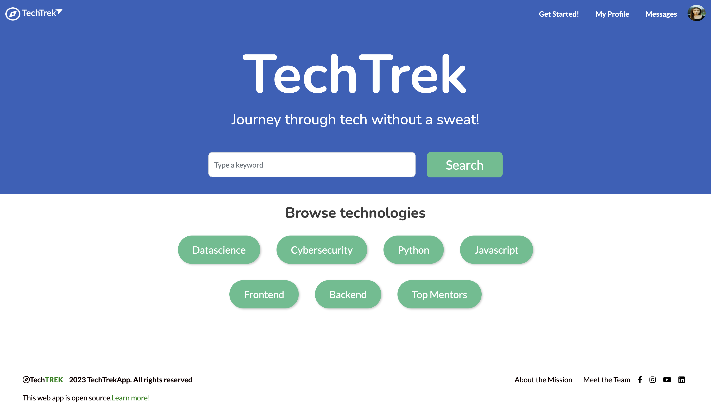

<a name="readme-top"></a>


[![Contributors][contributors-shield]][contributors-url]
[![Forks][forks-shield]][forks-url]
[![Stargazers][stars-shield]][stars-url]
[![Issues][issues-shield]][issues-url]
[![MIT License][license-shield]][license-url]


<!-- PROJECT LOGO -->
<br />
<div align="center">
  <a href="https://github.com/Version-LAA/techtrek">
    
  </a>

<h3 align="center">The TechTrekApp</h3>

  <p align="left">
    The TechTrekApp is a powerful application designed to connect students with mentors, field-specific programs, and career services, empowering them to elevate their tech careers to new heights.
    <br/>
    <br/>
    Whether you're a student exploring different tech disciplines or an aspiring professional looking to advance in your current field, The TechTrekApp is your ultimate companion on the journey to success.
    <br/>
    <br/>
    Join TechTrek today and unlock the doors to endless possibilities in the world of technology.
  <br/>
    <a href="https://github.com/Version-LAA/techtrek"><strong>Explore the docs »</strong></a>
    <br />
    <br />
    <div>
    <a href="https://www.techtrekapp.com/">View Demo</a>
    ·
    <a href="https://github.com/Version-LAA/techtrek/issues">Report Bug</a>
    ·
    <a href="https://github.com/Version-LAA/techtrek/issues">Request Feature</a>
    </div>
  </p>
</div>


<!-- TABLE OF CONTENTS -->
<details>
  <summary>Table of Contents</summary>
  <ol>
    <li>
      <a href="#about-the-project">About The Project</a>
      <ul>
        <li><a href="#built-with">Built With</a></li>
      </ul>
    </li>
    <li>
      <a href="#getting-started">Getting Started</a>
      <ul>
        <li><a href="#Getting-Started-&-Prerequisites">Getting Started & Prerequisites</a></li>
      </ul>
    </li>
    <li><a href="#usage">Usage</a></li>
    <li><a href="#roadmap">Roadmap</a></li>
    <li><a href="#contributing">Contributing</a></li>
    <li><a href="#license">License</a></li>
    <li><a href="#contact">Contact</a></li>
    <li><a href="#acknowledgments">Acknowledgments</a></li>
  </ol>
</details>


<!-- ABOUT THE PROJECT -->
## About The Project - Check out a live demo below!

https://github.com/Version-LAA/techtrek/assets/53385426/92a85acd-a339-4971-b2ba-3eab2f1753dc

## Project photos
<div align="center">
  
  

</div>
<p align="right">(<a href="#readme-top">back to top</a>)</p>


### Built With:

* [](https://rubyonrails.org/)
* [![Bootstrap][Bootstrap.com]][Bootstrap-url]
* [](https://guides.rubyonrails.org/active_record_basics.html)
* [](https://github.com/heartcombo/devise)
* [](https://www.postgresql.org/)
* [](https://www.heroku.com/)
* [](https://guides.rubyonrails.org/active_storage_overview.html)
* [](https://sass-lang.com/)
* [](https://cloudinary.com/)


<p align="right">(<a href="#readme-top">back to top</a>)</p>


<!-- GETTING STARTED -->
### Getting Started & Prerequisites

To successfully set up the project locally please ensure you have both Ruby 3.1.2 and Rails 7.0.4 installed prior to performing the following actions.

* Fork the repository - This creates a copy of the project under your own GitHub account.
:
```sh
  git clone git@github.com:Version-LAA/techtrek.git
```
* Obtain a free API from Cloudinary for image hosting
  * Create a Cloudinary Account for image hosting and obtain a free API Key a [https://cloudinary.com](https://cloudinary.com/users/register_free)
### Intallation

1. Install gems
```sh
  bundle install
```
2. Install yarn
```sh
  yarn install
```
3. Create and Migrate DB
```sh
  rails db:create db:migrate
```
4. Create a .env file to store your Cloudinary api key
```sh
  touch .env
  echo '.env*' >> .gitignore
```

5. Enter your cloudinary api key in .env file
```sh
  CLOUDINARY_URL=cloudinary://[#########:ABCDEDE-FJKEFEfeifej8u38434u343u4384]
```

6. run bundle install
```sh
  bundle install
```


<p align="right">(<a href="#readme-top">back to top</a>)</p>


<!-- USAGE EXAMPLES -->
## Usage

<p align="right">(<a href="#readme-top">back to top</a>)</p>


<!-- ROADMAP -->
## Roadmap
Features we ared hoping to release soon!
- Mentor Profiles
    - [Profile Creation](https://github.com/Version-LAA/techtrek/issues/155)
    - [Profile Editing](https://github.com/Version-LAA/techtrek/issues/156)
- [Message Notifications](https://github.com/Version-LAA/techtrek/issues/157)


See the [open issues](https://github.com/Version-LAA/techtrek/issues) for a full list of proposed features (and known issues).

<p align="right">(<a href="#readme-top">back to top</a>)</p>


<!-- CONTRIBUTING -->
## Contributing

We believe in the power of collaboration and continuous growth and greatly appreciate any contributions that make the open-source community thrive. Your ideas, suggestions, and enhancements are invaluable to us.

If you have a suggestion that can improve this project, we encourage you to fork the repository and create a pull request. Alternatively, you can open an issue with the "enhancement" tag. Don't forget to show your support by starring the project. Thank you for your contribution!


1. Fork the Project
2. Create your Feature Branch (`git checkout -b feature/AmazingFeature`)
3. Commit your Changes (`git commit -m 'Add some AmazingFeature'`)
4. Push to the Branch (`git push origin feature/AmazingFeature`)
5. Open a Pull Request

<p align="right">(<a href="#readme-top">back to top</a>)</p>


<!-- LICENSE -->
## License

Distributed under the MIT License. See `LICENSE.txt` for more information.

<p align="right">(<a href="#readme-top">back to top</a>)</p>


<!-- CONTACT -->
## Contact

Latoya - VersionLAA@gmail.com

Project Link: [https://github.com/Version-LAA/techtrek](https://github.com/Version-LAA/techtrek)

<p align="right">(<a href="#readme-top">back to top</a>)</p>


<!-- ACKNOWLEDGMENTS -->
## Acknowledgments
To the amazing core development team that worked tiredlessly to make this possible, thank you!

* [Kameron](https://github.com/Kameronjan)
* [Bertrand T.](https://github.com/btukov)
* [Andrew P.](https://github.com/andrewphan1)
* [Peter M.](https://github.com/mccdesign)

<p align="right">(<a href="#readme-top">back to top</a>)</p>


<!-- MARKDOWN LINKS & IMAGES -->
<!-- https://www.markdownguide.org/basic-syntax/#reference-style-links -->
[contributors-shield]: https://img.shields.io/github/contributors/Version-LAA/techtrek.svg?style=for-the-badge
[contributors-url]: https://github.com/Version-LAA/techtrek/graphs/contributors
[forks-shield]: https://img.shields.io/github/forks/Version-LAA/techtrek.svg?style=for-the-badge
[forks-url]: https://github.com/Version-LAA/techtrek/network/members
[stars-shield]: https://img.shields.io/github/stars/Version-LAA/techtrek.svg?style=for-the-badge
[stars-url]: https://github.com/Version-LAA/techtrek/stargazers
[issues-shield]: https://img.shields.io/github/issues/Version-LAA/techtrek.svg?style=for-the-badge
[issues-url]: https://github.com/Version-LAA/techtrek/issues
[license-shield]: https://img.shields.io/github/license/Version-LAA/techtrek.svg?style=for-the-badge
[license-url]: https://github.com/Version-LAA/techtrek/blob/master/LICENSE.txt
[linkedin-shield]: https://img.shields.io/badge/-LinkedIn-black.svg?style=for-the-badge&logo=linkedin&colorB=555
[linkedin-url]: https://linkedin.com/in/linkedin_username
[product-screenshot]: images/screenshot.png
[Next.js]: https://img.shields.io/badge/next.js-000000?style=for-the-badge&logo=nextdotjs&logoColor=white
[Next-url]: https://nextjs.org/
[React.js]: https://img.shields.io/badge/React-20232A?style=for-the-badge&logo=react&logoColor=61DAFB
[React-url]: https://reactjs.org/
[Vue.js]: https://img.shields.io/badge/Vue.js-35495E?style=for-the-badge&logo=vuedotjs&logoColor=4FC08D
[Vue-url]: https://vuejs.org/
[Angular.io]: https://img.shields.io/badge/Angular-DD0031?style=for-the-badge&logo=angular&logoColor=white
[Angular-url]: https://angular.io/
[Svelte.dev]: https://img.shields.io/badge/Svelte-4A4A55?style=for-the-badge&logo=svelte&logoColor=FF3E00
[Svelte-url]: https://svelte.dev/
[Laravel.com]: https://img.shields.io/badge/Laravel-FF2D20?style=for-the-badge&logo=laravel&logoColor=white
[Laravel-url]: https://laravel.com
[Bootstrap.com]: https://img.shields.io/badge/Bootstrap-563D7C?style=for-the-badge&logo=bootstrap&logoColor=white
[Bootstrap-url]: https://getbootstrap.com
[JQuery.com]: https://img.shields.io/badge/jQuery-0769AD?style=for-the-badge&logo=jquery&logoColor=white
[JQuery-url]: https://jquery.com
